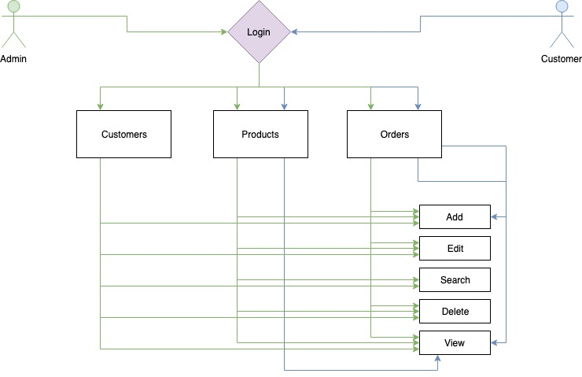

# MOONBUCKS RETAIL ORDER MANAGEMENT SYSTEM
JDK: **Java SE 12.0.2** 
IDE: **Eclipse IDE for Java Developers** 
Version: **2019-06 (4.12.0)** 
## General Overview:
There are two actors of the system:
1. Admin
2. Customer

Admin can **Add/Edit/Update/Edit/Delete**:
- Customers
- Products
- Orders

Customer can **Add/Edit/Update/Edit/Delete**:
- Orders

 Actors should be able to login in order to access the system.
  Program uses text files (.txt) to perform read/write operations.

